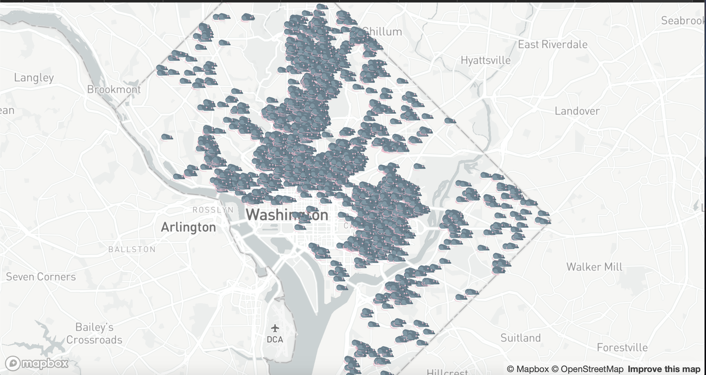
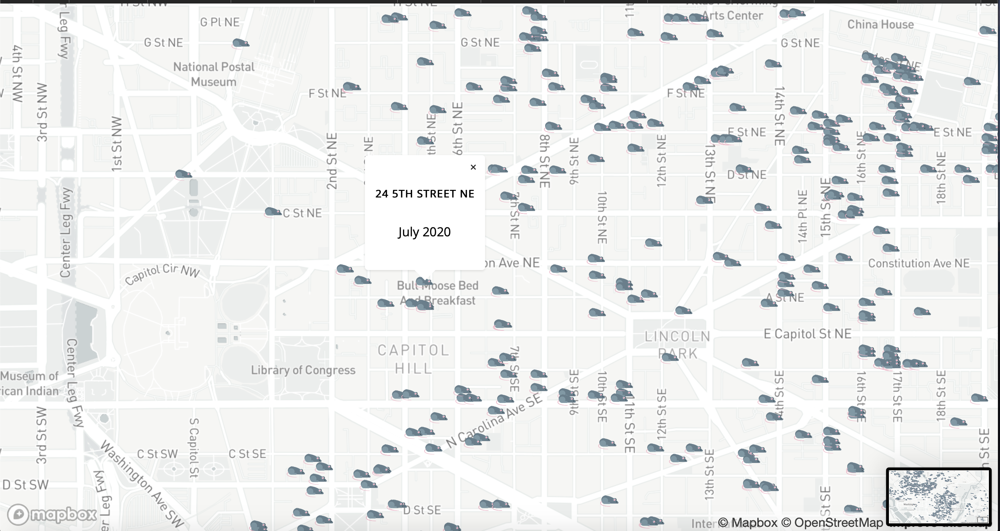

# DC Rat Map
## Version 1.0

- [Goals](#goals)
- [Appplication_View](#Application_View)
- [Description](#description)

## Goals

- Build a database of rodent inspection and treatment in D.C. 
- Produce a map of rodent events, using some opensource/public/free map library.
- Allow for full map control with zoom, 360 control. 

## Appplication_View

## Description 

This project makes use of DC's Rodent Inspection and Treatment in Last 30 Days dataset, which can be found here: https://opendata.dc.gov/datasets/rodent-inspection-and-treatment-in-last-30-days. 

It creates a map using Mapbox (https://www.mapbox.com) and assigns points to geospatial coordinates in the earlier saved datasets. The data is downloaded in CSV format, cleaned and then converted to GeoJSON for easier use of Mapbox's JS/Web libraries. 

The site should also eventually have a suite of tools to accompany the dataset, to faciliate communication with local officials and encourage civic engagement around rodents. 

Once a month, I pull the data in CSV format, simplify it and convert it to GeoJSON and update the HTML. This, in turn, builds a new version of the map. 
